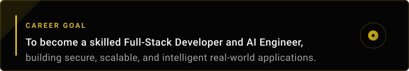

  
   
  

<h2 style="color: #D4AF37;">❖ About Me</h2>

  I am a <b>BCA Student</b> and passionate <b>Full-Stack Developer</b> dedicated to building secure, scalable, and intelligent real-world applications. My development focus centers on architecting robust backend systems, intuitive frontend interfaces, and practical software solutions that solve genuine technical problems.

  Beyond traditional web development, I have a deep interest in exploring <b>AI/ML</b>, intelligent systems, and automation. I enjoy integrating modern APIs and cybersecurity practices into my projects to ensure they are both powerful and protected. I am continuously learning Python, modern web frameworks, and artificial intelligence to stay at the cutting edge of technology.

  My ultimate career goal is to evolve into a proficient <b>Full-Stack Developer and AI Engineer</b>. Whether I am exploring new tech stacks or refining my programming foundation, my motivation is always driven by the desire to engineer high-quality, impactful software from the ground up.

 

  

 

  

 

### 💻 Programming Languages

  
  
  
  
  
  
  

### 🎨 Frontend Development

  
  
  
  

### ⚙️ Backend Development

  
  
  

### 🗄️ Databases

  
  
  
  

### 🛠️ Tools & Platforms

  
  
  
  
  
  
  
  

  

 

  

  A unified AI operating system designed to bring coding, debugging, research, productivity, automation, voice interaction, and other AI capabilities into one intelligent assistant.
    
  <b>Tech Stack:</b> <code>TBD</code> 
  <b>Status:</b> 🚧 In Development  
  
  

 

  

  A healthcare platform with separate Patient Portal, Doctor Portal, and Hospital Management Portal for connected healthcare workflows.
    
  <b>Tech Stack:</b> <code>TBD</code> 
  <b>Status:</b> 🚧 In Development  
  
  

 

  

  A multimodal AI content forensics platform designed to analyze text, images, video, and audio for AI-generated or synthetic content using evidence-based detection.
    
  <b>Tech Stack:</b> <code>TBD</code> 
  <b>Status:</b> 🚧 In Development  
  
  

 

  

  A digital healthcare companion focused on AYUSH-oriented health management, patient information, and AI-assisted healthcare workflows.
    
  <b>Tech Stack:</b> <code>TBD</code> 
  <b>Status:</b> 🚧 In Development  
  
  

*(More projects will be highlighted here as they are published.)*

  

 

  
  

 

  

 

  
  
  

 

  

 

  

  

<h2 style="color: #D4AF37;">❖ Contact Me</h2>

  
  
  
  

  

