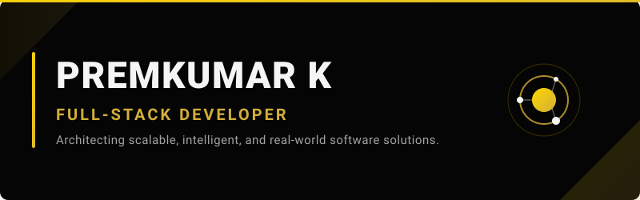

  
   
  

<h2 style="color: #D4AF37;">❖ About Me</h2>

  I am a dedicated <b>BCA Student</b> specializing in <b>Full-Stack Development</b> and the integration of <b>AI into modern applications</b>. My focus is firmly set on continuous learning, mastering new technologies, and refining my problem-solving skills to engineer practical, real-world software.

  Driven by a passion for scalable architecture, my objective is to evolve as a robust Full-Stack Developer and AI Engineer—capable of architecting intelligent, secure, and highly efficient systems from the ground up.

 

  

 

<h2 style="color: #D4AF37;">❖ Core Languages & Technologies</h2>

  
  
  
  
  
  
  

<h2 style="color: #D4AF37;">❖ Frontend Architecture</h2>

  
  
  
  
  
  
  
  

<h2 style="color: #D4AF37;">❖ Backend Architecture</h2>

  
  
  

<h2 style="color: #D4AF37;">❖ Database Architecture</h2>

  
  
  
  

<h2 style="color: #D4AF37;">❖ Professional Tools</h2>

  
  
  
  
  
  
  
  
  

<h2 style="color: #D4AF37;">❖ Projects</h2>

| Project Name | Description | Tech Stack | Live / Source |
| :--- | :--- | :--- | :--- |
| **[Project Title Placeholder](#)** | Brief, professional description of the project and its core impact. | React, Node.js | [View Live](#) \| [Code](#) |
| **[Project Title Placeholder](#)** | Brief, professional description of the project and its core impact. | Python, MongoDB | [View Live](#) \| [Code](#) |

*(More projects will be highlighted here as they are published.)*

<h2 style="color: #D4AF37;">❖ LeetCode Profile</h2>

  

  

<h2 style="color: #D4AF37;">❖ GitHub Analytics</h2>

  
  

 

  

<h2 style="color: #D4AF37;">❖ Contribution Activity</h2>

  

<h2 style="color: #D4AF37;">❖ Let's Connect</h2>

  
  
  
  

  

